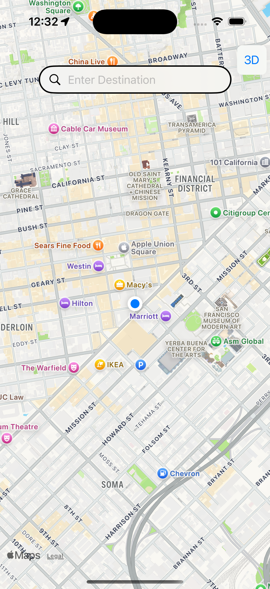
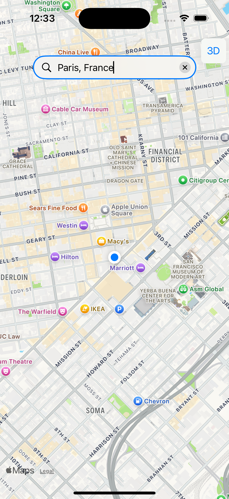
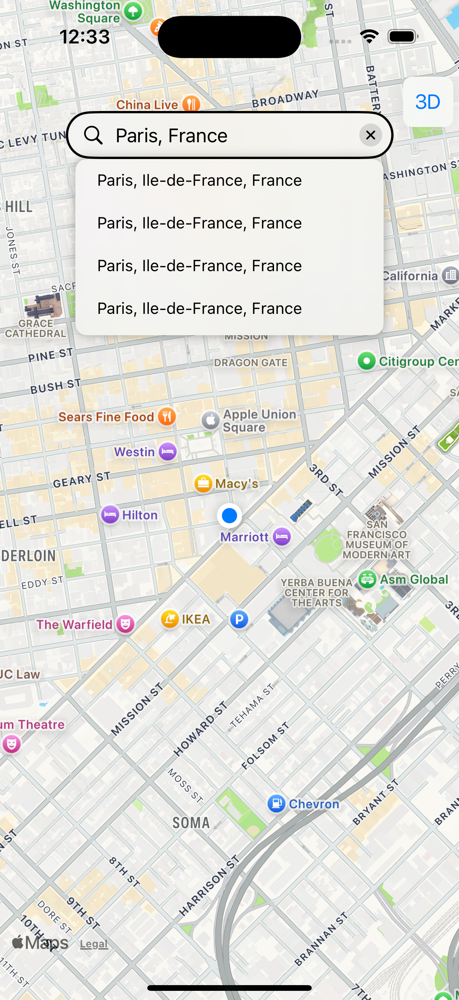
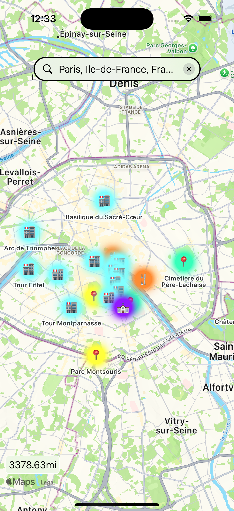
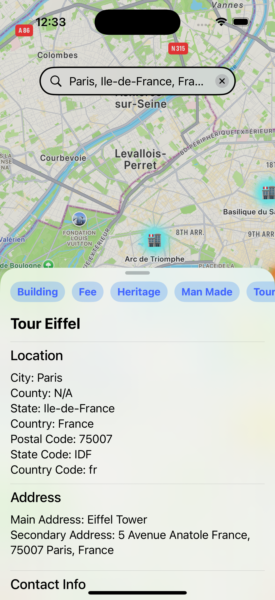

# What is ExploreIt?

ExploreIt is a tourist oriented app that allows users to search a destination of where they would like to go, and in exchange, they are given a variety of attractions to visit in that area.

# What are the features of the app?

* Search autocompletion if you are unsure with the destination name, ExploreIt will help you out!
* Icons and categories to help isolate what type of attraction or place it is such as a restaurant, park, historical building, etc.
* Access to the attractions address, phone number, email, and website (if given).
* A built-in distance calculator that calculates the distance between where you currently are and where you want to go to. 

# How to use the app?

1. Tap the search bar and enter the destination in which you want to go to.

2. Confirm the location by tapping on the autocompletion popup.

3. There you go! Enjoy exploring the attractions in the area.

